# Credit_Risk_Analysis
## Overview

In this project, we were tasked with understanding whether a credit card loan application should be viewed as high or low risk. To do this, we are going to use the credit card credit dataset from LendingClub, a peer-to-peer lending services company. A crucial part of understanding this project is recognizing that credit risk is an inherently unbalanced classification problem, as good loans easily outnumber risky loans. To counteract this and understand the efficacy of resampling, we will use 4 different resmpling methods. After that, we will compare two new machine learning models that reduce bias, BalancedRandomForestClassifier and EasyEnsembleClassifier, to predict credit risk.

## Results

In the proccess os resampling, we executed the following steps:
1. Resampled the dataset
2. Checked the balance of our target values
3. Trained the Logistic Regression model using the resampled data
4. Calculated the balanced accuracy score
5. Displayed the confusion matrix
6. Printed the imbalanced classification report

In the below charts, the way to read the Precision and Sensitivity chart is as follows:
Precision for high risk applications, precision for low risk application, sensitivity for high risk applications, sensitivity for low risk applications
|                 | Pre                   | Rec  |
| :-------------: |:-------------:        | :-------------:|
| High Risk       | Precision for high risk applications |  Sensitivity for high risk applications |
| Low Risk        | Precision for low risk applications |  Sensitivity for low risk applications |

### Resampling Results

| Resampling Type      | Accuracy Score                                            | Precision and Sensitivity  |
| :-------------:      |:-------------:                                            | :-------------:|
| Oversampling         | 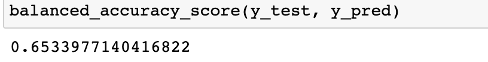   | 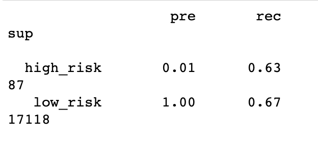 |
| SMOTE Oversampling   | 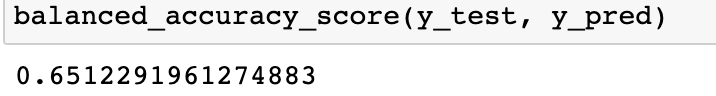                 | 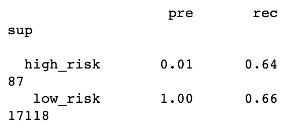 |
| Undersampling        | 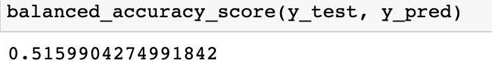 | 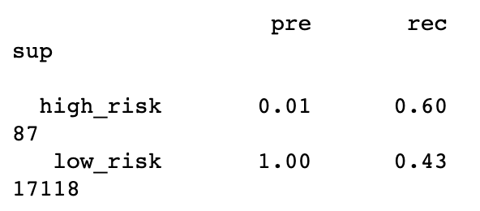 |
| Combination Sampling | 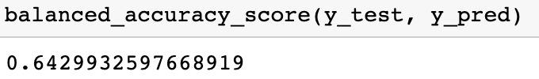                 | 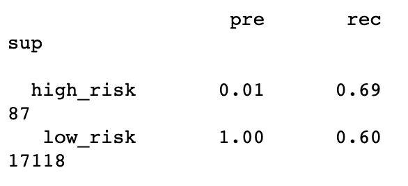 |

### Ensemble Results
| Ensemble Type      | Accuracy Score                          | Precision and Sensitivity  |
| :-------------:    |:-------------:                          | :-------------:|
| Random Forest      | 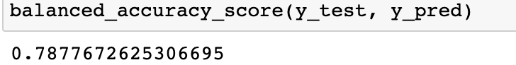   | 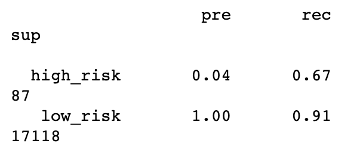 |
| Easy Ensemble      | 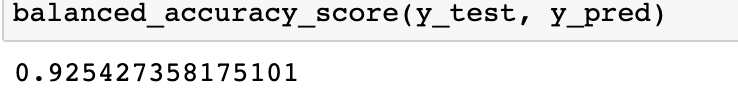   | 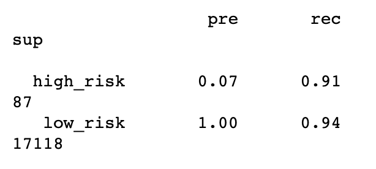 |

## Summary

If we look at the numbers showing how each model performed, the model that performed the best seems to be the Easy Ensemble Adaboost Classifier. It had the higest accuracy score and had the highest sensitivity when it came to picking up high risk applications. The only model that I feel would be worth using would be the Easy Ensemble Adaboost Classifier. While it is not very precise at properly detecting high risk credit applications, the sensitivity score means that it will be more likely to pick high risk credit applications even though it may pick up a few false positves. In the event of a false high risk alert application, in theory, we could always manually review those applications to see if they are in fact high risk.
